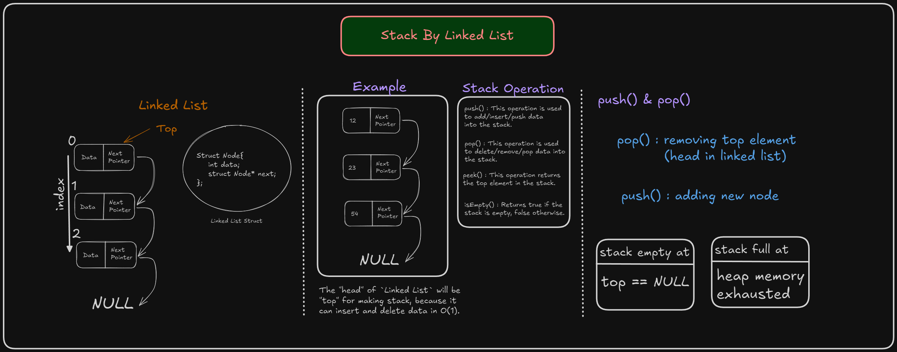

# Stack Implementation using Linked List

## Overview

This project demonstrates how to implement a stack data structure using a singly linked list in C. A stack is a linear data structure that follows the **Last In, First Out (LIFO)** principle. The most recent element added is the first one to be removed. Operations such as **push** (add), **pop** (remove), and **peek** (view an element) are essential for stack manipulation.

In this implementation, each element of the stack is stored in a **node** of a linked list, where each node points to the next one, with the last added element (the **top**) pointing to `NULL` when it is the only node or the end of the stack.


---

## Code Explanation

### 1. Structure of a Node

A node is the building block of the stack in this implementation. Each node contains two parts:
- `data`: the value or element stored in the node.
- `next`: a pointer to the next node in the stack.

Here’s the struct that defines the node:

```c
typedef struct Node {
    int data;               // Data stored in the node
    struct Node* next;      // Pointer to the next node
} Node;
```

---

### 2. Stack Operations

#### Push Operation

The `push` function adds a new node to the top of the stack. This involves:
- Allocating memory for the new node.
- Assigning the new node’s `data`.
- Setting the `next` pointer of the new node to the current top.
- Updating the top pointer to the new node.

```c
void push(Node** top, int number) {
    Node* ptr = (Node*)malloc(sizeof(Node)); // Allocate memory for the new node
    if (ptr == NULL) {  // Check if memory allocation succeeded
        printf("Memory allocation failed\n");
        return;
    }
    ptr->data = number;        // Set the data for the new node
    ptr->next = *top;          // Link the new node to the current top
    *top = ptr;                // Update the top pointer to the new node
}
```

#### Pop Operation

The `pop` function removes the top element from the stack. It checks if the stack is empty, and if not:
- Saves the current top node.
- Moves the top pointer to the next node.
- Returns the popped node.

```c
Node* pop(Node** top) {
    if (isEmpty(top)) {
        printf("Error: Stack is empty\n");
        return NULL;  // Return NULL if the stack is empty
    }
    Node* ptr = *top;          // Save the current top node
    *top = (*top)->next;       // Move the top pointer to the next node
    return ptr;                // Return the popped node
}
```

#### Peek Operation

The `peek` function returns the data of the node at a specific index in the stack without removing it. It traverses the stack from the top until it reaches the given index.

```c
int peek(Node** top, int index) {
    Node* ptr = *top;          // Start from the top of the stack
    if (isEmpty(top)) {
        printf("Error: Stack is empty\n");
        return -1;             // Return -1 if the stack is empty
    } else {
        int i = 0;             // Initialize an index counter
        while (ptr != NULL) {
            if (index == i) {  // Check if the current index matches the requested index
                return ptr->data; // Return the data of the node at the index
            }
            i++;
            ptr = ptr->next;   // Move to the next node
        }
    }
    printf("Error: Invalid position\n");
    return -1;                 // Return -1 if the index is invalid
}
```

---

### 3. Utility Functions

#### `isEmpty`

This function checks if the stack is empty by checking if the top pointer is `NULL`.

```c
int isEmpty(Node** top) {
    return *top == NULL;
}
```

#### `showStack`

The `showStack` function displays all elements of the stack from top to bottom. It prints each node's data and shows `NULL` to indicate the end of the stack.

```c
void showStack(Node** top) {
    if (*top == NULL) {
        printf("Error: Stack is empty\n");
        return;
    }
    Node* ptr = *top;           // Start from the top of the stack
    printf("Stack Contains:\n");
    while (ptr != NULL) {
        printf("%d\n", ptr->data); // Print the data of the current node
        ptr = ptr->next;          // Move to the next node
    }
    printf("NULL\n\n");         // Indicate the end of the stack
}
```

---

## Memory Management

When using dynamic memory allocation (`malloc`), it’s important to free the memory after it's no longer needed to prevent memory leaks. In this case, after popping an element from the stack, its memory is freed using `free`.

```c
Node* poppedNode = pop(topPtr);
if (poppedNode != NULL) {
    printf("Popped element is %d\n", poppedNode->data);
    free(poppedNode); // Free the memory after use
}
```

---

## Example Output

```
Stack Contains:
15
NULL

Popped element is 15
Error: Stack is empty

Stack Contains:
12
23
54
NULL

Element at index 2 is 54
```

---

## Conclusion

This implementation of a stack using a linked list is efficient in terms of memory usage as it dynamically allocates memory for each node. Unlike a stack implemented using an array, this approach does not have a fixed size, allowing you to grow the stack as needed.

Feel free to experiment with this code and see how stacks work under the hood!